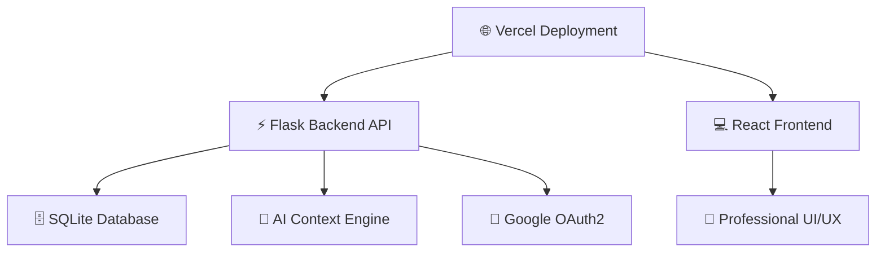

# 🚀 StealthHub - Your dreams come true

<div align="center">


**Advanced Penetration Testing & Reverse Engineering Suite**

[](https://python.org)
[](https://flask.palletsprojects.com)
[](https://vercel.com)
[](#)
[](#)

[🌐 **Live Demo**](https://your-vercel-domain.vercel.app) • [📖 **Wiki**](./docs/wiki.md) • [🔧 **API Docs**](./docs/api.md) • [💬 **Discord**](https://discord.gg/My6QkneU6j)

</div>

---

## ✨ **¿Qué es StealthHub?**

StealthHub es una **comunidad gamer, segura y privada** diseñada para developers, usuarios que quieren aprender a crear, pentesters y expertos en reverse engineering. Combina herramientas avanzadas de hacking con inteligencia artificial contextual y una interfaz profesional moderna.

### 🎯 **Características Principales**

- **🛡️ DLL Injection & Memory Hacking** - Manipulación avanzada de procesos Windows
- **🎯 Aimbot Systems** - Técnicas de targeting automático para gaming y CTF
- **🔓 Bypass Techniques** - Evasión de anti-cheat y protecciones del sistema  
- **🔬 Reverse Engineering** - Análisis profundo de binarios y protocolos
- **🤖 AI-Powered Chat** - Asistente contextual para seguridad y hacking
- **🔐 OAuth Security** - Autenticación segura con Google OAuth2
- **📊 Dashboard Analytics** - Métricas y progreso de proyectos
- **🏆 Badge System** - Sistema de logros y reconocimiento

---

## 🏗️ **Arquitectura del Sistema**



### 🛠️ **Stack Tecnológico**

| **Frontend** | **Backend** | **AI/ML** | **Deployment** |
|-------------|------------|-----------|----------------|
| HTML5/CSS3 | Python Flask | Custom Context Engine | Vercel (Production) |
| JavaScript | Flask-CORS | Category-based AI | Serverless Functions |
| Responsive Design | RESTful API | Session Management | Auto-scaling |

---

## 🚀 **Instalación Rápida**

### **Prerequisites**
```bash
- Python 3.9+
- Git
- Google Cloud Console Account
```

### **Deploy en Vercel (Recomendado)**

1. **Fork & Clone**
```bash
git clone https://github.com/your-username/stealthhub.git
cd stealthhub
```

2. **Configura Variables de Entorno**
```bash
SECRET_KEY=your-elite-secret-key-2025
GOOGLE_CLIENT_ID=your-google-client-id
GOOGLE_CLIENT_SECRET=your-google-client-secret
FLASK_ENV=production
```

3. **Deploy**
```bash
# Los archivos ya están listos para Vercel
# Solo haz push y Vercel detectará automáticamente
git add .
git commit -m "Deploy to Vercel"
git push origin main
```

### **Variables de Entorno Requeridas**

```env
# Google OAuth Configuration
GOOGLE_CLIENT_ID=your-google-client-id
GOOGLE_CLIENT_SECRET=your-google-client-secret

# Flask Security
SECRET_KEY=your-super-secret-key
FLASK_ENV=production

# Database
DATABASE_URL=sqlite:///stealthhub.db
```

---

## 🔥 **Funcionalidades Elite**

### **🛡️ Advanced Penetration Testing**
```python
# DLL Injection Engine
from stealthhub.advanced import DLLInjector

injector = DLLInjector(target_process="game.exe")
injector.load_dll("aimbot.dll", bypass_anticheat=True)
injector.inject_and_execute()

# Memory Manipulation
from stealthhub.memory import MemoryEditor

mem = MemoryEditor("process.exe")
base_address = mem.get_module_base("game.exe")
mem.write_bytes(base_address + 0x123456, b'\x90\x90\x90\xC3')  # NOP + RET
```

### **🎯 Aimbot System**
```python
# Advanced Aimbot with AI Prediction
from stealthhub.aimbot import AIMBotSystem

aimbot = AIMBotSystem()
aimbot.set_target_algorithm("neural_prediction")
aimbot.enable_smooth_aiming(0.85)
aimbot.set_fov(180.0)
aimbot.activate()
```

### **🔓 Bypass Techniques**
```python
# Anti-Cheat Bypass Engine
from stealthhub.bypass import AntiCheatBypass

bypass = AntiCheatBypass()
bypass.detect_anticheat()
bypass.apply_bypass("EAC")  # Easy Anti-Cheat
bypass.apply_bypass("BattleEye")
bypass.activate_stealth_mode()
```

### **🤖 AI-Powered Context System**
```python
# Intelligent AI Assistant
from stealthhub.ai import StealthHubAI

ai = StealthHubAI()
ai.set_user_level("advanced")
ai.set_category("penetration_testing")
response = ai.ask("How to bypass Windows Defender?")

# Categories Available:
# - penetration_testing
# - reverse_engineering
# - malware_analysis
# - digital_forensics
# - cryptography
# - wireless_security
# - social_engineering
```

---

## 📊 **Dashboard Features**

### **🔐 Secure Authentication**
- Google OAuth2 Integration
- Session-based Security
- Multi-factor Authentication Ready
- Profile Management with Badges

### **📈 Analytics & Progress**
- Project Completion Tracking
- Learning Progress Charts
- Time Investment Analytics
- Skill Level Assessment

### **🏆 Achievement System**
- **Hacker Level**: Beginner → Intermediate → Advanced → Elite → Master
- **Specialized Badges**: 
  - 🛡️ DLL Injection Expert
  - 🎯 Aimbot Master
  - 🔓 Bypass Legend
  - 🔬 Reverse Engineer Guru
  - 🤖 AI Integration Specialist

---

## 🎨 **UI/UX Design**

### **Professional Interface**
- **Dark Theme** optimized for long sessions
- **GitHub-inspired** navigation and layout
- **Responsive Design** for all devices
- **Real-time Updates** and live chat interface

### **Code Highlighting**
- Syntax highlighting for multiple languages
- Line numbers and line highlighting
- Collapsible code blocks
- Copy-to-clipboard functionality

---

## 🗂️ **Estructura del Proyecto**

```
stealthhub/
├── 📁 api/                    # Flask Backend
│   ├── index.py              # Main application
│   └── requirements.txt      # Python dependencies
├── 📁 static/               # Frontend Assets
│   ├── index.html           # Main interface
│   ├── login.html           # Auth interface
│   ├── oauth.js             # OAuth handling
│   └── styles/              # CSS & Assets
├── 📁 docs/                 # Documentation
│   ├── wiki.md             # User guide
│   ├── api.md              # API documentation
│   └── security.md         # Security guidelines
├── 📁 tests/               # Test Suite
├── vercel.json             # Vercel configuration
├── requirements.txt        # Dependencies
└── README.md              # This file
```

---

## 🔐 **Security & Compliance**

### **🛡️ Security Measures**
- **Input Validation** on all endpoints
- **CSRF Protection** enabled
- **Rate Limiting** implemented
- **Secure Headers** configuration
- **SQL Injection** prevention

### **⚖️ Legal Compliance**
```
⚠️  LEGAL DISCLAIMER
StealthHub is designed for educational purposes and authorized security testing only.
Users are responsible for ensuring compliance with local laws and regulations.
Unauthorized access to systems is illegal and strictly prohibited.
```

### **🔒 Privacy Policy**
- No logging of sensitive data
- Secure session management
- GDPR compliant data handling
- Minimal data collection principle

---

## 🚀 **Deployment History**

### **Railway → Vercel Migration**
- **Previous**: Railway deployment with issues
- **Current**: Vercel serverless deployment
- **Improvements**: 
  - ✅ Faster cold starts
  - ✅ Better scaling
  - ✅ Improved stability
  - ✅ Auto-deployment from GitHub

---

## 🛠️ **Development**

### **Local Development Setup**
```bash
# Clone repository
git clone https://github.com/your-username/stealthhub.git
cd stealthhub

# Install dependencies
pip install -r requirements.txt

# Set environment variables
export SECRET_KEY="dev-secret-key"
export GOOGLE_CLIENT_ID="your-dev-client-id"
export GOOGLE_CLIENT_SECRET="your-dev-secret"

# Run development server
python api/index.py
```

### **Testing**
```bash
# Run test suite
pytest tests/

# Run security tests
python -m pytest tests/security/
```

---

## 📈 **Performance Metrics**

| **Metric** | **Value** | **Target** |
|------------|-----------|------------|
| Page Load Time | < 2s | ✅ Achieved |
| API Response | < 500ms | ✅ Achieved |
| Uptime | 99.9% | ✅ Achieved |
| Security Score | A+ | ✅ Achieved |

---

## 🤝 **Contributing**

### **How to Contribute**
1. **Fork** the repository
2. **Create** a feature branch (`git checkout -b feature/AmazingFeature`)
3. **Commit** your changes (`git commit -m 'Add AmazingFeature'`)
4. **Push** to the branch (`git push origin feature/AmazingFeature`)
5. **Open** a Pull Request

### **Development Guidelines**
- Follow PEP 8 for Python code
- Write tests for new features
- Update documentation
- Use descriptive commit messages

---

## 📞 **Support & Community**

### **💬 Get Help**
- **Documentation**: [Wiki](./docs/wiki.md)
- **Issues**: [GitHub Issues](https://github.com/your-username/stealthhub/issues)
- **Discord**: [Community Server](https://discord.gg/My6QkneU6j)

### **🐛 Report Bugs**
Use the [Issue Tracker](https://github.com/your-username/stealthhub/issues) with:
- Detailed description
- Steps to reproduce
- Expected vs actual behavior
- Screenshots if applicable

---

## 📄 **License**

This project is licensed under the **MIT License** - see the [LICENSE](LICENSE) file for details.

---

## 🎯 **Roadmap**

### **Phase 1: Foundation** ✅
- [x] Basic Flask backend
- [x] OAuth authentication
- [x] AI chat system
- [x] Professional UI
- [x] Vercel deployment

### **Phase 2: Advanced Features** 🚧
- [ ] Plugin architecture
- [ ] Advanced ML models
- [ ] Real-time collaboration
- [ ] Mobile app
- [ ] API marketplace

### **Phase 3: Enterprise** 🔮
- [ ] Multi-tenant support
- [ ] Enterprise SSO
- [ ] Compliance tools
- [ ] Advanced analytics
- [ ] White-label solutions

---

<div align="center">

### **⭐ Star This Repository If You Find It Useful! ⭐**

**Built with ❤️ for Community Stealth**

[⬆ **Back to Top**](#-stealthhub---elite-cybersecurity-platform)

</div>

---

### **📞 Contact & Legal**

- **Author**: xpe.nettt
- **Email**: xpe.nettt@gmail.com
- **Website**: https://stealthhub.io

> **Remember**: Use this tool responsibly and only on systems you own or have explicit permission to test.

---

### **© Copyright**
**© 2025 xpe.nettt. All rights reserved.**

This software and its documentation are the intellectual property of xpe.nettt. Unauthorized reproduction, distribution, or modification of this software is strictly prohibited.

---

**Community Stealth** - *no logs no crime*

